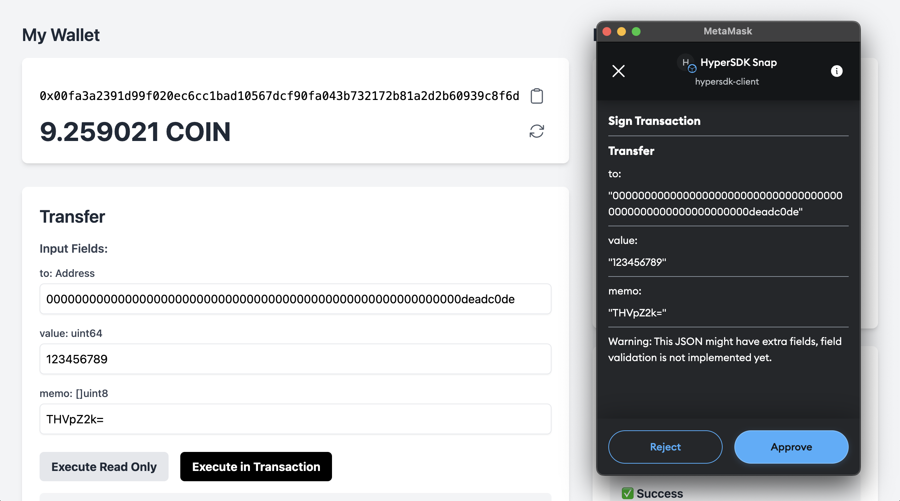

# HyperSDK Starter

## 0. Prerequisites
- Golang v1.22.5+
- NodeJS v20+
- Docker (Somewhat recent)
- Optional: [Metamask Flask](https://chromewebstore.google.com/detail/metamask-flask-developmen/ljfoeinjpaedjfecbmggjgodbgkmjkjk). Disable normal Metamask, Core wallet, and any other wallets. *Do not use your actual private key with Flask*.

## 0. Clone this repo
`git clone https://github.com/ava-labs/hypersdk-starter.git`

## 1. Start the Whole Stack

Run: `docker compose up -d --build devnet faucet frontend`. Might take 5 minutes to download dependencies.

For devcontainers or codespaces, forward ports 8765 for faucet, 9650 for the chain, and 5173 for the frontend.

Open [http://localhost:5173](http://localhost:5173) to see the frontend. Play around with it. Try both the Temporary key and Metamask snap (from npm, not local).

That's how it should look with Metamask Snap signing:

When finished, shut everything down with: `docker compose down`

## 2. Add a read-only action

### 2.1 Add an action
### 2.1 Register an action and it's return type
### 2.2 Test your read only action

## 3. Write some data into state

## 4. Develop a Frontend
1. Bring down everything: `docker compose down`
2. Start only the devnet, and faucet: `docker compose up -d --build devnet faucet`
3. Navigate to the web wallet: `cd web_wallet`
4. Install dependencies and start the dev server: `npm i && npm run dev`

Ensure ports `8765` (faucet), `9650` (chain), and `5173` (frontend) are forwarded.

Please learn more on [npm:hypersdk-client](https://www.npmjs.com/package/hypersdk-client) and in the `web_wallet` folder of this repo.

## Notes
- You can launch everything without Docker:
  - Faucet: `go run ./cmd/faucet/`
  - Chain: `./scripts/run.sh`
  - Frontend: `npm run dev` in `web_wallet`
- Be aware of potential port conflicts if issues arise. `docker rm -f $(docker ps -a -q)` is your friend.
- For VM development you don't have to know Javascript - you can use an existing frontend container

