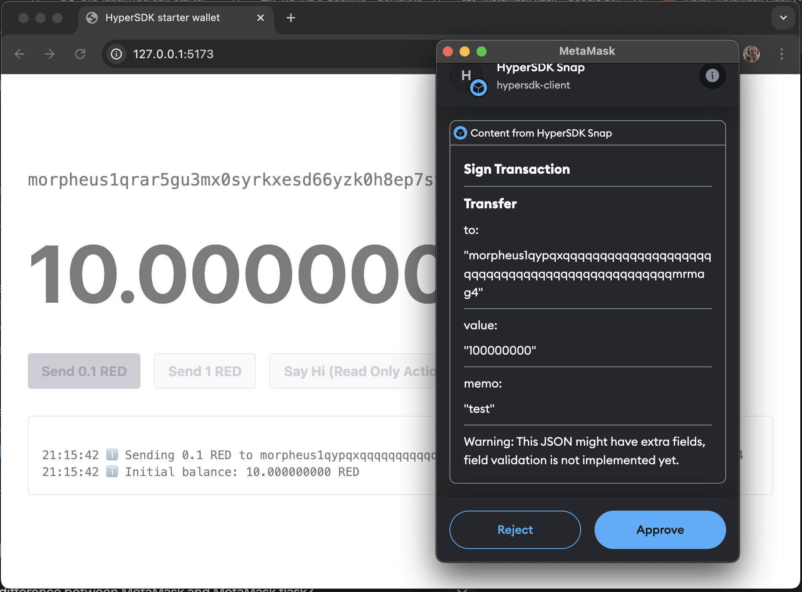

# HyperSDK Starter

## 0. Prerequisites
- Install [Metamask Flask](https://chromewebstore.google.com/detail/metamask-flask-developmen/ljfoeinjpaedjfecbmggjgodbgkmjkjk) and disable normal Metamask, Core wallet, and any other wallets.
- Install Golang and a fresh NodeJS.
- This has not been tested on native Mac; everything is run in a devcontainer.
- ~~`go run ./cmd/keygen/`. It will fill the necessary env variables in the `.env` file. The faucet will not work without it.~~

## 1. Start the Whole Stack

Run: `docker compose up -d --build devnet faucet frontend`

For devcontainers or codespaces, forward ports 8765 for faucet, 9650 for the chain, and 5173 for the frontend.

Open [http://localhost:5173](http://localhost:5173) to see the frontend. Play around with it. Try both the Temporary key and Metamask snap (from npm, not local).

That's how it should look with Metamask Snap signing:

When finished, shut everything down with: `docker compose down`

## 2. Develop a VM

To develop or port new actions:
1. Add them in the `actions/` folder.
2. Register them in `vm/vm.go`.
3. Rebuild the stack with: `docker compose up -d --build devnet faucet frontend`

There are read-only and read-write actions. Ensure actions have `***Result` types defined in `vm/vm.go`. Use read-only actions instead of RPC API.

By the way, the Go code depends on the [`read-only-actions` branch](https://github.com/ava-labs/hypersdk/tree/read-only-actions) of HyperSDK. So copy-pasting actions would not work; you'll need to define the return types.

## 3. Develop a Frontend
1. Bring down the frontend container: `docker compose down`
2. Start only the devnet and faucet: `docker compose up -d --build devnet faucet`
3. Navigate to the web wallet: `cd web_wallet`
4. Install dependencies and start the dev server: `npm i && npm run dev`

Ensure ports `8765` (faucet), `9650` (chain), and `5173` (frontend) are forwarded.

Note that most functionality depends on the `hypersdk-client` npm package.

## 4. Publish on a remote server
1. Set `DOCKER_HOST` to your server's IP.
2. Set the `SERVE_DOMAIN` variable in the `.env` file in your project's directory to your domain.
3. Run `docker compose up -d --build proxy`. That will do the trick. That's it.

## Notes
- You can launch everything without Docker:
  - Faucet: `go run ./cmd/faucet/`
  - Chain: `./scripts/run.sh`
  - Frontend: `npm run dev` in `web_wallet`
- Instead of `docker compose up -d --build devnet faucet frontend`, you can use `docker compose up -d --build frontend`. The `frontend` service will automatically start `faucet` and `devnet` as dependencies.
- Be aware of potential port conflicts if issues arise.